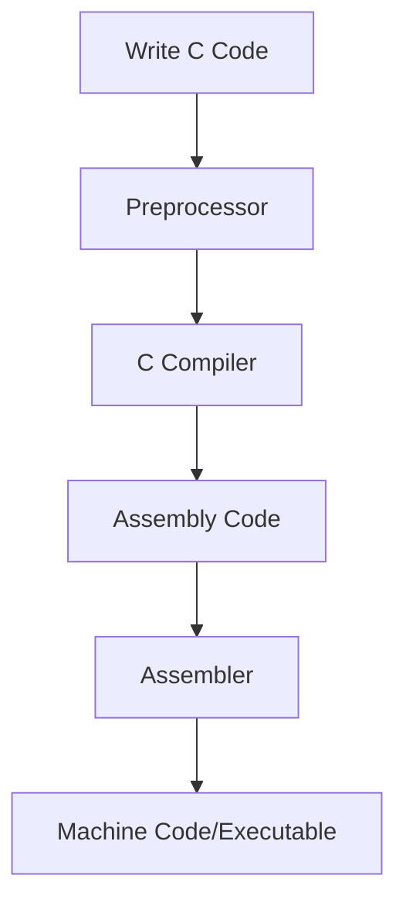
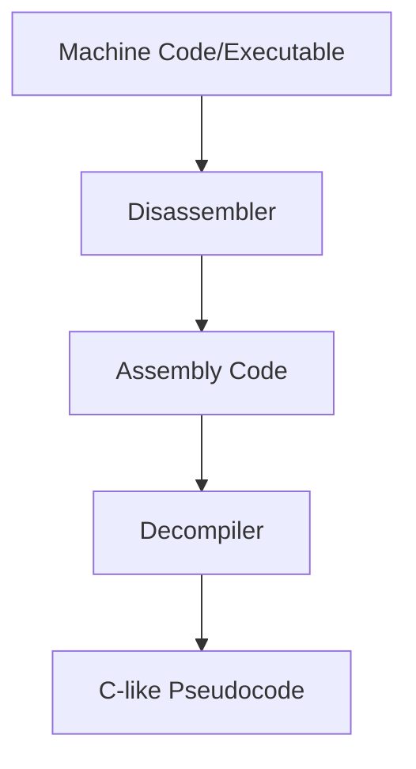
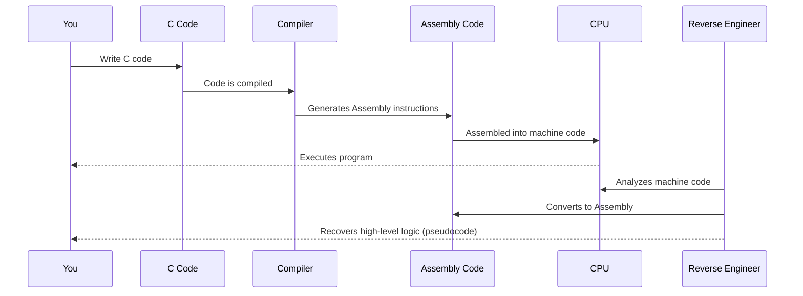

# A Beginner-Friendly Journey: C, Assembly, and Reverse Engineering

You might already be familiar with a few basic concepts—like how operating systems mention micro operations (those tiny actions performed by the CPU) and the role of Assembly in managing them. This story will build on that understanding, showing you how high-level C code connects with low-level Assembly and how reverse engineering helps us peek behind the scenes.

---

## 1. A Quick History and Why It Matters

In the early days, programmers wrote directly in **Assembly language** to control every micro operation of the hardware. While this gave precise control, it was tedious and error-prone. **C** was created as a higher-level language that still allows close-to-hardware programming. It simplifies coding without losing the ability to optimize performance. Understanding this relationship is useful, whether you're learning how operating systems work or diving into reverse engineering.

---

## 2. How C Becomes an Executable Program

Let’s break down how C code is transformed into the program that runs on your computer.



### What's Happening Here?

1. **Preprocessing**:  
   The preprocessor handles directives (like `#include` or `#define`) to prepare your code.
2. **Compilation**:  
   The C compiler translates your human-readable code into Assembly code, which is a set of instructions that are closer to the hardware.
3. **Assembly and Assembling**:  
   The Assembly code is then converted into machine code (the actual binary instructions) by the assembler. This machine code is what the CPU executes, managing all the micro operations.

---

## 3. A Simple Example: Adding Two Numbers

Consider this small C function:

```c
int add(int a, int b) {
    return a + b;
}
```

Even this simple function goes through several steps to become something the CPU can understand:

```mermaid
flowchart LR
    A[High-Level C Code: add()]
    B[Intermediate Code (IR)]
    C[Optimized IR]
    D[Assembly Instructions]
    E[Machine Code]
    
    A --> B
    B --> C
    C --> D
    D --> E
```

### How It Transforms

- **IR Generation**:  
  The compiler first creates an intermediate representation (IR) of your C code.
- **Optimization**:  
  The IR is optimized (e.g., by simplifying calculations).
- **Assembly Generation**:  
  The optimized IR is then turned into Assembly code (using instructions like `mov`, `add`, and `ret`).
- **Final Machine Code**:  
  The assembler converts Assembly into machine code that the CPU executes.

---

## 4. Reverse Engineering: Going Backwards

Reverse engineering is the process of taking compiled machine code and trying to understand or recreate the original logic in a more human-friendly form. This is especially useful if you ever need to analyze software without access to its source code.



### The Reverse Engineering Steps

1. **Disassembling**:  
   Tools like IDA Pro or Ghidra convert machine code back into Assembly language.
2. **Analyzing Assembly**:  
   By examining the Assembly code, you can see how the micro operations are organized.
3. **Decompiling**:  
   A decompiler then tries to recreate the higher-level logic, often in a C-like pseudocode format.
4. **Understanding the Code**:  
   With the pseudocode, you can piece together how the program works, even if some details remain hidden due to optimizations.

---

## 5. Tying It All Together

Even if you have just a slight understanding from your OS studies, recognizing the connection between C, Assembly, and reverse engineering can deepen your insight. Here’s a simple sequence diagram that shows the flow:



---

## 6. Conclusion

By connecting your understanding of micro operations and operating systems with how C code becomes executable and can be reverse engineered, you gain a complete picture of the software development lifecycle. This journey from high-level C to low-level Assembly and back through reverse engineering is a powerful concept—helping you understand everything from performance optimizations to software security.

Whether you’re relearning OS fundamentals or diving into the details of reverse engineering, this story serves as a bridge between what you already know and the deeper intricacies of how our code interacts with hardware.
